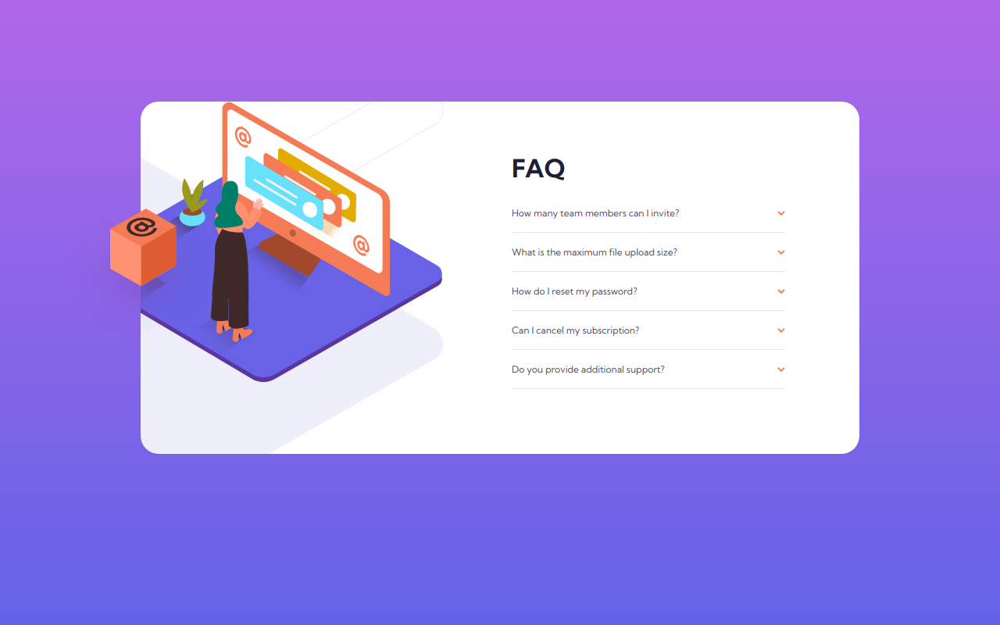

# Frontend Mentor - FAQ accordion card solution

This is a solution to the [FAQ accordion card challenge on Frontend Mentor](https://www.frontendmentor.io/challenges/faq-accordion-card-XlyjD0Oam). Frontend Mentor challenges help you improve your coding skills by building realistic projects. 

## Table of contents

- [Overview](#overview)
  - [The challenge](#the-challenge)
  - [Screenshot](#screenshot)
  - [Links](#links)
- [My process](#my-process)
  - [Built with](#built-with)
  - [What I learned](#what-i-learned)
  - [Continued development](#continued-development)
  - [Useful resources](#useful-resources)
- [Author](#author)

## Overview

### The challenge

Users should be able to:

- View the optimal layout for the component depending on their device's screen size
- See hover states for all interactive elements on the page
- Hide/Show the answer to a question when the question is clicked

### Screenshot

### Links

- Live Site URL: [https://faq-accordion-card-eosin.vercel.app/](https://faq-accordion-card-eosin.vercel.app/)
- Solution URL: [https://www.frontendmentor.io/solutions/faq-with-react-Q8ANxNeI5T](https://www.frontendmentor.io/solutions/faq-with-react-Q8ANxNeI5T)

## My process

### Built with

- SCSS
- [React](https://reactjs.org/) - JS library

### What I learned

I learned about the details and questions HTML tags.

### Continued development

I need to improve these kind of layouts with overlapping images.

### Useful resources

- [
: The Details disclosure element](https://developer.mozilla.org/en-US/docs/Web/HTML/Element/details) - This helped me to do the list of questions.

## Author

- Frontend Mentor - [@miguelzaga](https://www.frontendmentor.io/profile/miguelzaga)
